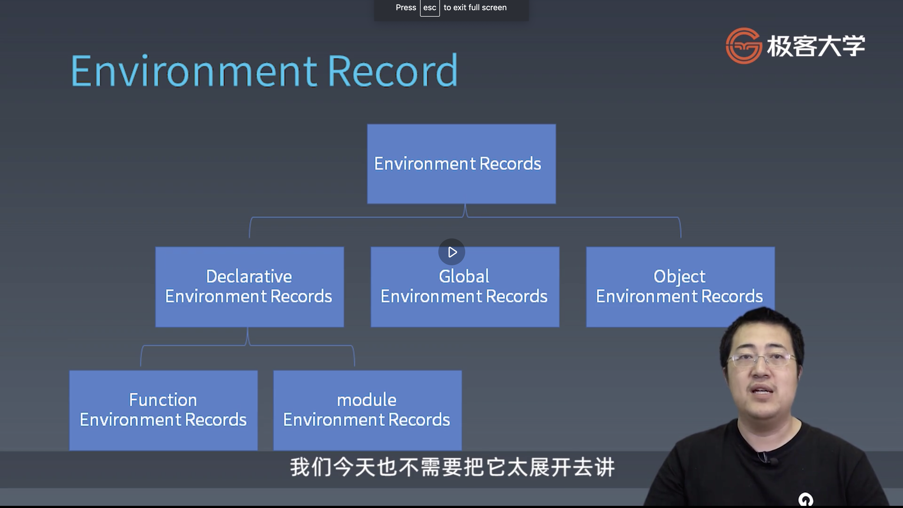

学习笔记

### JS表达式 | 运算符和表达式

1. Javascript
    * Atom
    * Expression
    * Statement
    * Structure
    * Program/Module


2. Atom
    * Grammar
        * Grammar Tree vs Priority
        * Left hand side & Right hand side
    * Runtime
        * Type Conversion
        * Reference

3. Grammar
    * Tree vs Priority
        * +/-
        * *//
        * ()

keyword: 优先级/语法结构/一个正则表达式的语法树的解析（1 + 2 * 3）

运算具有优先级，运算遵循一定的语法结构，我们可以通过语法树去描述运算。

4. Expression
    * Member
    ```js
        a.b

        a[b]

        foo`string`

        super.b

        super[`b`]

        new.target

        new Foo()
    ```
    * New
        * new Foo
    * Example
        * new a()()
        * new new a()

keyword: 
* Member运算的优先级大于 New

5. Reference
    * Object
    * Key

    * delete
    * assign

keyword:
* Reference/

question1: 什么是引用类型？请举出例子。
question2: 引用类型由什么组成？请举出例子。
question3: 请描述delete/assign对member进行操作的过程。

6. Expressions
    * Call
        * foo()
        * super()
        * foo()['b']
        * foo().b
        * foo()`abc`
    * Example:
        * new a()['b']
keyword:
*  当点运算与函数调用结合时， member运算产生降级。所以优先级会随着前值的改变而改变， 真正要清晰的描述优先级，还是要使用bnf


7. Left hand side & Right hand side
    * Express:
        * a.b = c;
        * a + b = c; 


Key Point:
* left hand 只能放左边， right hand只能放右边。 a + b 是right hand 所以会报错.

8. 不能放等号左边的
    * Update
        * a++
        * a--
        * --a
        * ++a
    * Example
        * ++a++
        * ++(a++)
    * Unary
        * delete a.b
        * void foo()
        * typeof a
        * +a
        * -a
        * ~a
        * !a
        * await a

9. Exponental: 右结合
```
**
```
Example:
3 ** 2 ** 3
3 ** (2 ** 3)

10. 更低一级的优先级
    * Multiplicative
    ```
    * / %
    ```
    * Additive
    ```
    + -
    // + 可以字符串或者数字相加
    ```
    * Shift
    ```
    <</>>/>>>
    ```
    * Relationship
    ```
    </>/<=/>=/instanceof/in
    ```
    * Equality
        * ==
        * !=
        * ===
        * !==
    * Bitwise
        * & ^ |
    * Logical
        * && // 短路运算
        * ||
    * Condition
        * a ? b : c; // 有短路运算

### JS表达式 | 类型转换
1. Example
    * a + b
        * 如果 a/b均为数字类型， 则正常进行运算
        *  如果a/b其一不为数字类型，则触发类型转化
    * "false" == false
    *  a[o] = 1;
2. 类型转化矩阵


3. 拆箱转化（unboxing）
    * ToPremitive
```js
    var o = {
        toString() {return "2";},
        valueOf() {return 1;},
        // 若定义了toPrimitive方法， 则在转化的时候会忽略toString和valueOf方法
        [Symbol.toPrimitive(){return 3}]
    }
```
    * toString vs valueOf
    * Symbol.toPrimitive

key point:
* 什么是拆箱转化？
    * object => 基本类型
* 什么时候发生toPremitive?
    * 在表达式中， 对象需要进行运算的时候（例如加法中的一方是对象）
* toString/valueOf调用的判定方式？
    * 根据上下文的提示， 例如
        * 如果为加法， 优先调用valueOf
        * 如果对象作为属性名， 则优先调用toString

4. 装箱转化


key point
* 什么是装箱转化？
    * 使用new Number('1'), 返回的不是一个原语类型而是一个number对象
*  使用symbol装箱转化需要使用new Object


Quiz: 完成StringToNumber/NumberToString
```js
// 不同进制的number的string, 转为number形式
// 0x11

// var a = 0b10;
// var b = 070;
// var c = 0x36;

const StringToNumber = () => {

};

// type 为进制类型
const NumberToString = (type) => {

};

```

### JS语句 | 运行时相关概念
1. Statement
    * Grammar
        * 简单语句： 不会容纳其他语句
            * Expression Statement
            * Empty Statement
            * Debugger Statement
            * Throw Statement
            * Continue Statement
            * Break Statement
            * Return Statement
        * 复合语句
            * Block Statement:花括号中间包含多个语句
                ```js
                {
                    // statement1
                    // statement2
                }
                // Completion Record
                [[type]]: normal
                [[value]]: -
                [[target]]: -
                    
                ```
            * If Statement
            * Switch Statement
            * Iteration Statement
                ```js
                while() {};
                do{} while();
                for(;;);
                for(  in );
                for(  of );
                for await (of)
                ```
            * With Statement
            * Labelled Statement
            * Try Statement
                ```js
                try{

                } catch(e) {

                } finally {

                }
                // Completion Record
                [[type]]: return // 尽管在try 中return了， 但是 finally中的代码依旧会执行
                [[value]]: -
                [[target]]: label
                ```
        * 声明(其中， 函数声明以及var定义的变量会出现提升， 而class/const/let则不会出现提升， 并且会在定义之前的部分出现死区)
            * Function Declaration
            ```js
                function
            ```
            * Generator Declaration
            ```js
                function*
            ```
            * Async Function Declaration
            ```js
                async function
            ```
            * Async Generator Declaration
            ```js
                async function *
            ```
            * Variable Statement
            ```js
                var b = 2;
                var a = b + 1;
            ```
            * Class Declaration
            ```js
                class Person {

                }
            ```
            * Lexical Declaration: const/let
            ```js
                let a = 1;
                const b = 2;
            ```
    * Runtime
        * Completion Record: 包含函数运行时的信息， 例如， 是否返回了？返回值是啥？等等
        ```js
        // Example
            if(x === 1) return 10;

        // 基本组成
        [[type]]: normal, break, continue, return or throw
        [[value]]: 基本类型
        [[target]]: label
        ```
        * Lexical Environment
    * per-process: 预处理： 在代码执行之前， 会对代码本身执行一次预处理 
        ```js
        // example 1: a = 2
        var a = 2;
        void function() {
            a = 1;
            return;
            var a;
        }();
        console.log(a);

        // example 2: throw die zone error
        var a = 2;
        void function() {
            a = 1;
            return;
            const a;
        }();
        console.log(a);
        ```
    * 作用域
        ```js
        // example 1: a = 2
        var a = 2;
        void function() {
            a = 1;
            {
                var a;
            }
        }();
        console.log(a);

        // example 2: const 的初始化必须给值啊， 因为是常量不可以二次赋值。所以以下的操作是不允许的
        var a = 2;
        void function() {
            a = 1;
            {
                const a;
            }
        }();
        console.log(a);

        ```
        

question
* 什么是with statement/labelled statement?

### 6. JS结构化 | 宏任务和微任务
1. js执行粒度（运行时）
    * 宏任务: 传给js引擎的任务
    * 微任务(Promise)： 在js引擎内部的任务
    * 函数调用(Execution Context)
    * 语句/声明(Completion Record)
    * 表达式(Reference)
    * 直接量/变量/this...

2. 宏任务和微任务

* 宏任务就是把我们写的代码丢给引擎
* 微任务是引擎执行过程中遇到异步代码段的时候， 产生的job

3. 事件循环

事件循环分成3步：
    1. 获取代码
    2. 执行
    3. 等待

4. 函数调用
```js
    // file main.js
    import {foo} from 'foo.js';
    var i = 0;
    console.log(i);
    foo();
    console.log(i);
    i++;

    // foo.js
    function foo() {
        console.log(i);
    }

    export foo;
```

函数调用产生执行上下文(execution context)，上下文包含完成函数调用所需的所有信息。这是一个栈结构(execution context stack)， 先进后出。当前执行到的位置就是顶层栈， 顶层栈包含我们此时此刻能访问到的所有变量（running execution context）.

So execution context 里边究竟包含什么呢？包含一下七种。
* code evaluation state： 用于async/generator函数， 用于保持函数执行到哪的信息
* function： 由function初始化
* script or module： script或者module出现的时初始化
* generator： 只有generator函数创建的时候会出现
* realm： 保持所有我们使用的内置对象的王国或者领域
* lexical environment： 分别代表我们执行代码所需要访问的环境， 也就保存变量的环境
* variable environment： 用var声明变量的时候， 声明到的环境

5. Execution Context: 
    * ECMAScript code execution contexts(没有generator)
        * code evaluation state
        * function
        * script or module
        * realm
        * lexical environment
        * variable environment
    * Generator execution contexts(包含generator)
        * code evaluation state
        * function
        * script or module
        * generator
        * realm
        * lexical environment
        * variable environment

6. Lexical Environment
    * this
    ```js
    this.a = 1;
    ```
    * new.target
    ```js
    new.target
    ```
    * super
    ```js
    super();
    ```
    * 变量
    ```js
    x += 2;
    ```

7. Variable Environment: 历史包袱， 只用于var声明的变量

8. Environment Record: 实际上是一个树形结构

其中，global和object是特殊的结构， 例如global肯定是用于全局挂载， 只有一个， 而object是给with使用的。我们最常用的还是declarative.

9. 闭包： 在js中每个函数都会生成一个闭包。


10. Realm
    * 在js中， 函数表达式和对象直接量均会创建对象。
    * 使用点运算符做隐式转化也会创建对象。
    * 这些对象也存在原型， 如果我们没有reaml， 就不知道他们的原型是什么。