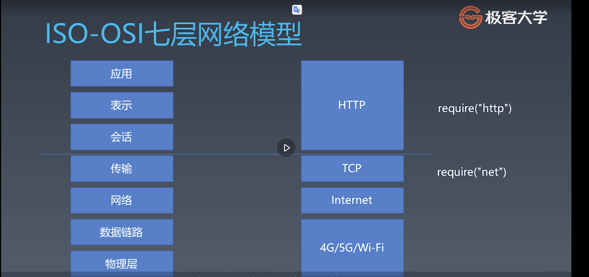
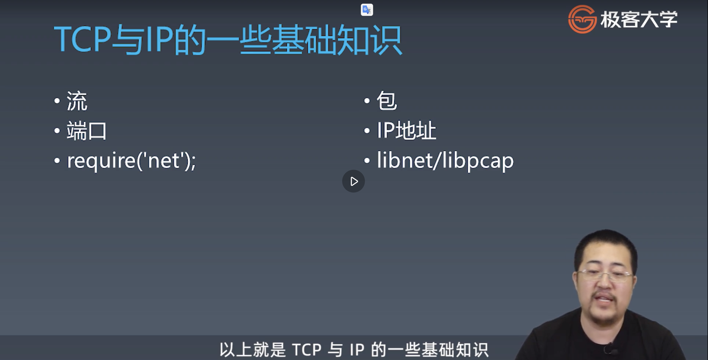

### 1. 浏览器总论 | 浏览器工作原理总论

1. browser complete a render need 5 stpe
    * URL parse
        * HTTP Request
        * parse HTTP Response
        * get HTML => 
    * HTML parse
        * get Dom => 
    * DOM parse
    * DOM with CSS
    * DOM with Position
    * Bitmap
        * last step browser transform bitmap into GPU and then GPU transfom the bitmap into light signal. Lastly, we can see the image. 


### 基本知识：
* 每个状态机都是一个机器
    * 在每一个机器里我们可以做计算， 存储， 输出。。。
    * 在所有的机器接受的输入是一致的
    * 状态机的每一个机器本身没有状态， 如果我们用函数表示， 它应该为纯函数
* 每一个机器知道下一个状态 
    * 每个机器都有确定的下一个状态（moore)： 不带分支， 但是很简单
    * 每个机器根据输入决定下一个状态（mealy): 带分支

### 在js中的有限状态机（mealy）:
```js
// 定义， 每一个函数是一个状态
function state(input) {
    // 在函数中可以自由的编写代码， 处理每一个逻辑的状态
    // 在mealy状态机中，input必定与return 相关联
    // 而在moore状态机中则不然
    return next; // 返回值作为下一个状态
}

// 使用
while(input) {
    state = state(input); // 把状态机返回的值作为下一个状态
}
```


### 状态机的实际应用

1. quiz: 在一个字符串中， 找到字符“ a”
```js
const str = "b acddd";
const matchA = (s) => {
    for(let c of s) {
        if(c === 'a') {
            return true;
        }
    }
    return false;
}
findA(str);

```

2. quiz: 在一个字符串中， 找到字符串 "ab"
```js
const str = "b acddd  ab";
const matchAB = (s) => {
    let hasA = false;
    let hasB = false;
    for(let c of s) {
       if(c!=='a' && c != 'b') {
           hasA = false;
           hasB = false;
           continue;
       }
       if(c === 'a' &&  !hasA) {
           hasA = true;
       }
       if(hasA && !hasB && c === 'b') {
           hasB = true;
       }
       if(hasA && hasB) {
           return true;
       }
    }
    return hasA && hasB;
}
matchAB(str);
```

3. quiz: 在字符串中找到‘abcdef’
```js
const str = "zabcdef";
const match = (s) => {
    let validateFn = (c) => isa(c)
    for (let c of s) {
        let next = validateFn(c);
        if (typeof next === 'function') {
            validateFn = next;
        } else (next === true) {
            return true;
        } 
    }
}

const isf = c => {
    if (c && c === 'f') {
        return true;
    }
    return start(c);
}

const ise = c => {
    if (c && c === 'e') {
        return isf;
    }
    return start(c);
}

const isd = c => {
    if (c && c === 'd') {
        return ise;
    }
    return start(c);
}

const isc = c => {
    if (c && c === 'c') {
        return isd;
    }
    return start(c);
}

const isb = c => {
    if (c && c === 'b') {
        return isc;
    }
    return start(c);
}

const isa = c => {
    if (c && c === 'a') {
        return isb;
    }
    return start(c);
}

console.log(`result is${match(str)}`);

```

```js
// winter 状态机版本
const str = "zabcdef";
const match = (s) => {
    // answer
    let state = start;
    for (let c of s) {
        state = state(c)
    }
    return state === end;
}

const start = (c) => {
    if (c === 'a') {
        return isa;
    }
    return start;
}

const end = (c) => {
    return end;
}

const isf = c => {
    if (c && c === 'f') {
        return true;
    }
    return start(c);
}

const ise = c => {
    if (c && c === 'e') {
        return isf;
    }
    return start(c);
}

const isd = c => {
    if (c && c === 'd') {
        return ise;
    }
    return start(c);
}

const isc = c => {
    if (c && c === 'c') {
        return isd;
    }
    return start(c);
}

const isb = c => {
    if (c && c === 'b') {
        return isc;
    }
    return start(c);
}

const isa = c => {
    if (c && c === 'a') {
        return isb;
    }
    return start(c);
}

console.log(`result is${match(str)}`);
```

3. quiz: 使用转态机在字符串中找到'abcabx'


### HTTP请求 | HTTP的协议解析
1. ISO-OSI网络模型

网络模型由上到下， 分为七层模型。不懂的层级解决不同的问题。而作为前端， 我们平时主要跟http打交道， 也就是图中的应用/表示/会话层。

2. TCP/IP的基础知识


对应两种类型。 tcp和ip的不同在于：
* tcp
    * 使用流传输， 也就是不存在最小单位的分割，比如： 包
    * tcp被计算机内不同的软件使用， 每一个软件都会通过网卡去拿数据， 根据端口把数据包分发给各个应用
    *  在node中对应的是net这个module
* IP
    * 最小单位是包
    * 通过ip来判定这个数据包的流向
    * node没有对应的包， 但是在底层调用来c++的libnet(负责构造ip包， 并且发送)/libcap(负责从网卡抓所有流经网卡的ip包)

3. http
    * request
    * response

    * http协议
        * 文本型的协议
        * 把内容当作字符串传输
        * http在tcp的上层
        * 基本结构
            * request
                * request line
                    * method
                    * 协议类型
                    * path
                * header: 多行 用冒号分隔， 一个空行作为结束
                    * content-type
                    * host
                * body: 由content-type决定
            * response
                * status line
                    * HTTP version
                    * status code
                    * http status text
                * header: 多行 用冒号分隔， 一个空行作为结束
                * body
                    * 十六进制的数字
                    * 内容
                    * 十六进制的数字

与tcp的双工通信不一样， res和req是一一对应的。总是先由一方发出req然后， 另一方作出res.

4. 设计一个http请求
    * 拼装参数阶段
        * 从使用的方式考虑实现
        * content-type作为必要的字段， 需要提供默认值
        * http的body是一个key-value pair
        *  不同的content-type有不懂的body handler
    * send函数的设计
        * 在request构造函数中收集必要信息
        * 设计一个send函数， 把请求真实的发送到服务器
        * send函数应该是异步的， 所以返回的是一个promise.
            * 设计支持复用已有的connection/如果没有则新建一个connection
            * 把收到的数据给parser
            * 根据parser的状态resolve Promise
    * ResponseParser的总结
        * response 必须分段构造， 所以我们使用response parser来进行装配
        * response parser的分段处理responseText, 我们使用状态机来分析文本结构
    * HTML的parser
        * 增加parser结构
            * 为了方便管理， 我们把parser单独拆分到文件中
            * 大概思路是： parser接受html文本作为参数， 返回一颗dom树
        * 增加FSM实现状态机的架子
            * 使用FSM来实现html的分析
            * 在html的文档中已经规定了html的状态
            * toyBrowser只会实现其中一部分的状态机
            * parser html 状态机的实现
                * html标签分类
                    * 开始标签
                    * 结束标签
                    * 自封闭标签
                * 在这一步的处理我们忽略了属性值的处理， 完成了状态迁移的逻辑。
        * 在parser状态机中加入currentToken. 完成解析后值的计算
            * 在上一步我们完成了状态机的状态迁移逻辑， 在这一步我们加入了业务逻辑， 创建token
            * 在标签的结束状态提交标签的token
        * 增加属性值的处理
            * 属性值分为单引号/双引号/无引号三种写法， 因此需要对各个状态增加状态机
            * 处理属性的流程跟标签类似
            * 属性结束时， 把属性添加到标签token上
        * 使用上一步获取到token构建dom树
            * 从标签构建dom树的基本技巧是使用栈
            * 遇到 开始标签的时候入栈， 遇到结束标签出栈
            * 自封闭标签视为入栈之后， 立刻出栈
            * 任何元素的父级元素都是它入栈前的栈顶元素
        * 处理文本节点， 把文本节点添加到dom树上
            * 文本节点的处理与自封闭标签类似
            * 多个文本节点需要合并成一个文本节点

    