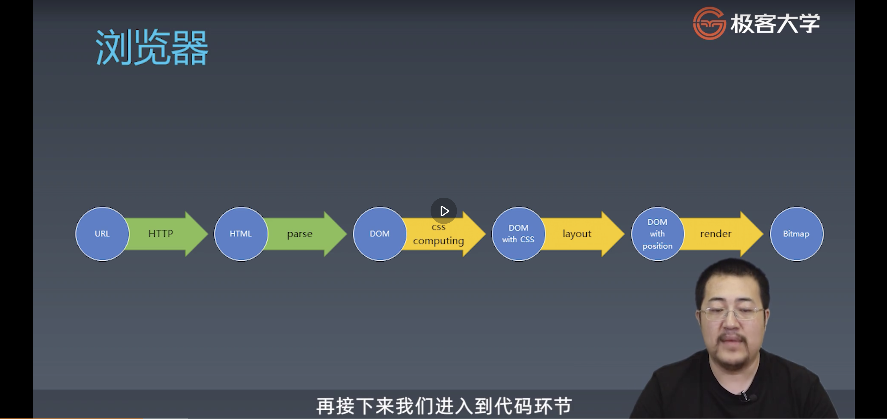
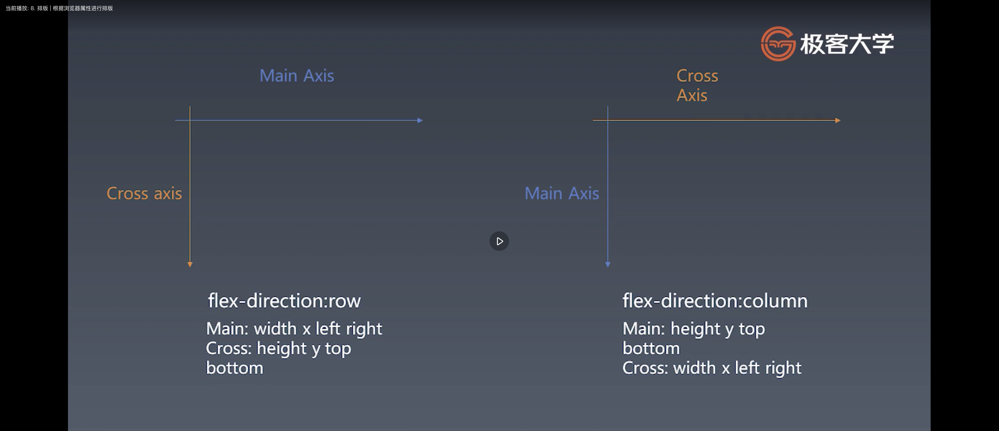
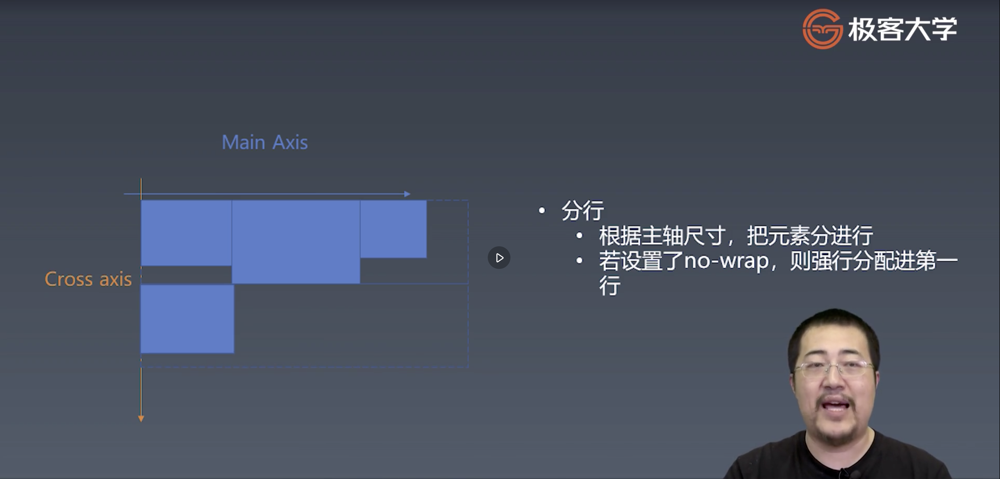
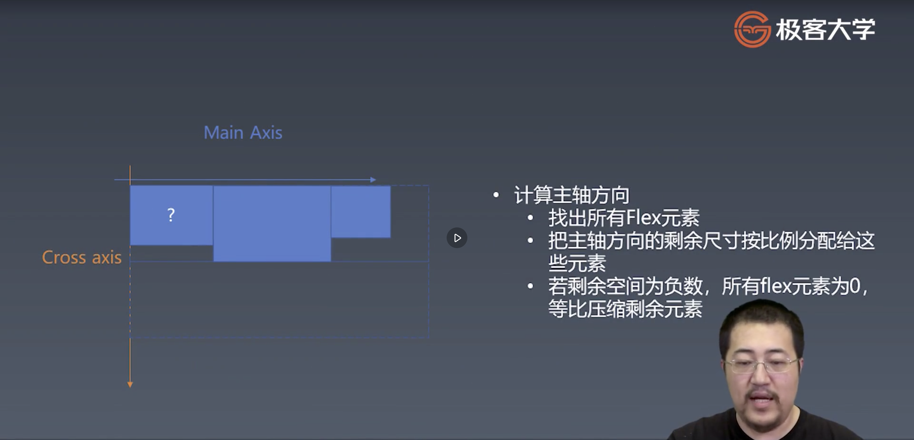
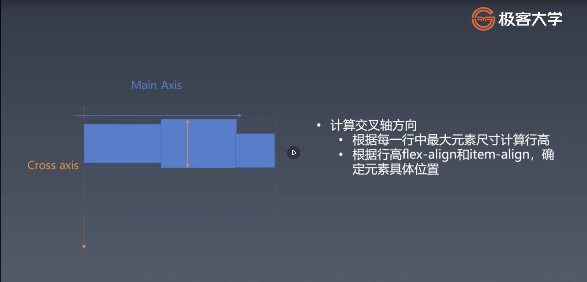

### css 计算 | 收集css的规则
总结
* 遇到style标签把css规则保存起来
* 在这个例子中我们调用css parser来分析css规则
* 在这里我们需要非常仔细的研究此库分析css规则的格式

### 2. CSS计算 | 添加调用
css的设计会尽可能的保证所有的选择器都能够在startTag进入的时候， 就能够被判断。也就是， 当dom树构建到当前元素的start标签， 就已经可以判断出来该标签可以匹配哪些规则了。

总结：
* 创建一个元素后会立即的计算css
* 理论上， 当我们分析一个元素时， 所有的css规则已经收集完毕
* 在真实的浏览器中， 可能遇到写在body中的style标签， 需要重新css计算的情况， 在这里我们忽略了这种情况

### 3. CSS计算 | 获取父元素序列
css总是与父级元素紧密相关的.

总结：
*  在compute css函数中， 我们必须先知道元素的所有父级元素才能判断元素是否与css规则相匹配
*  我们从上一步骤中的stack， 可以获取本元素的所有父元素
* 因为我们首先获取的是当前元素， 所以我们获得和计算父元素匹配的顺序是从内向外。 例如：
```
 div div #myid
 在这个例子中，myid我们一定是匹配了当前元素， 而前面俩div我们不知道匹配的是哪个元素。所以我们一定是从最后一个选择器开始匹配
```

### 4. CSS计算 | 选择器与元素的匹配

总结：
* 选择器也要从当前元素向外排列
* 复杂选择器拆成针对单个元素的选择器， 用循环匹配父级元素队列

*  根据选择器类型和元素属性， 计算是否与当前元素 匹配
* 这里仅仅实现了三种基本的选择器（class/id/tag）， 实际浏览器中肯定还有更为复杂的场景， 例如attribute选择器
* 可选作业： 实现复合选择器， 实现支持空格的class选择器

### 5. css计算 | 生成computed属性
总结：
* 一旦选择器匹配上， 那么就要把对应的rules放到元素上， 形成computedStyle

### 6. css计算 | specificity的计算逻辑

css优先级计算逻辑： 根据权重加总计算

* 权重计算方式：
    ```
    // 根据css的选择器生成四元组, 根据四元组计算每个style rule的优先级

    // div div #id
        [inline, id, class, tag];
    数量 [0,      1,  0,     2];

    // div #id #myid
        [inline, id, class, tag];
    数量 [0,      2,  0,     1];

    // 比较方式为进位制， 如果靠前的优先级比较出来了， 就不会再往后面去比较
    ```

总结：
* css 规则是根据specificity和后来优先的规则进行覆盖
* specificity是一个四元组， 越左边权重越高
* 一个css规则的specificity根据所包含的简单选择器进行相加而得出


### 8. 排版 | 根据浏览器属性进行排版


layout布局发生在endTag之前.

总结：
1. 在这一部分， 主要做了预处理的工作， 比如css属性的默认值设置（flexDirection/wrap）
2. 对height/width等属性进行了抽象，抽象为main/cross axis 相关属性

### 9. 排版 | 收集元素进行(hang 一声)


总结：
1. 分行算法中心思想是
    * 根据主轴尺寸， 把元素进行分行收集
    * 如果设置了no wrap则强行分配进第一行


### 10. 排版 | 计算主轴 


### 11. 排版 | 交叉轴计算


### 12. 渲染 | 绘制单个元素
总结
* 绘制需要依赖一个图形环境， 在这里我们采用了npm包 images
* 绘制在一个viewPort上进行
* 与绘制相关的属性需要在render里边进行实际的渲染（前一步我们只是得到了绘制相关的属性而已这一步才是真的渲染开始）， 包括： background-color, border, background-image等

### 13. 渲染 | 绘制dom树
总结
* 递归调用子元素的绘制方法即可完成dom树的绘制.
* 在我们的toy browser会忽略掉一些不需要绘制的节点.
* 实际浏览器中， 文字的绘制是技术难点， 需要依赖字体库， 我们这里忽略