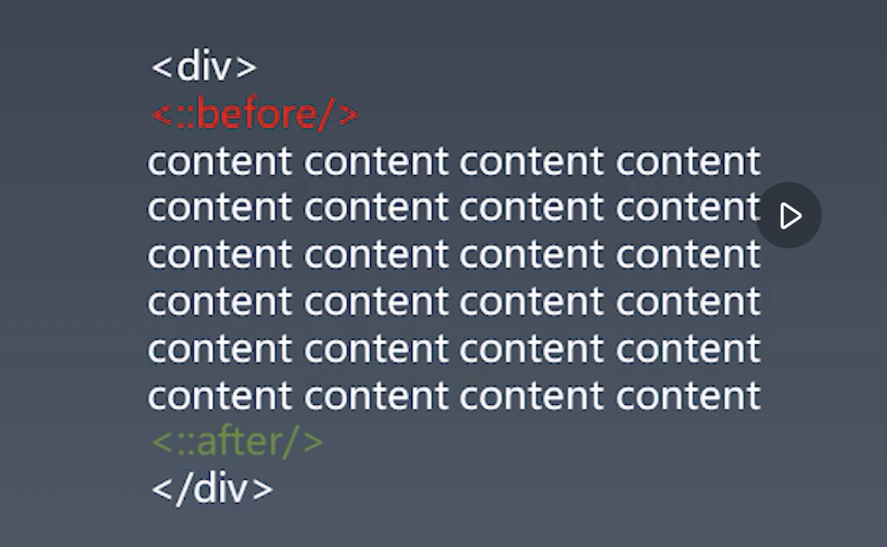
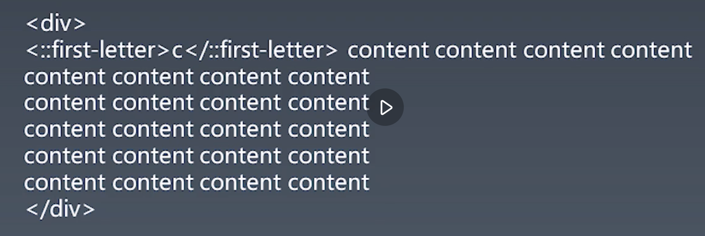
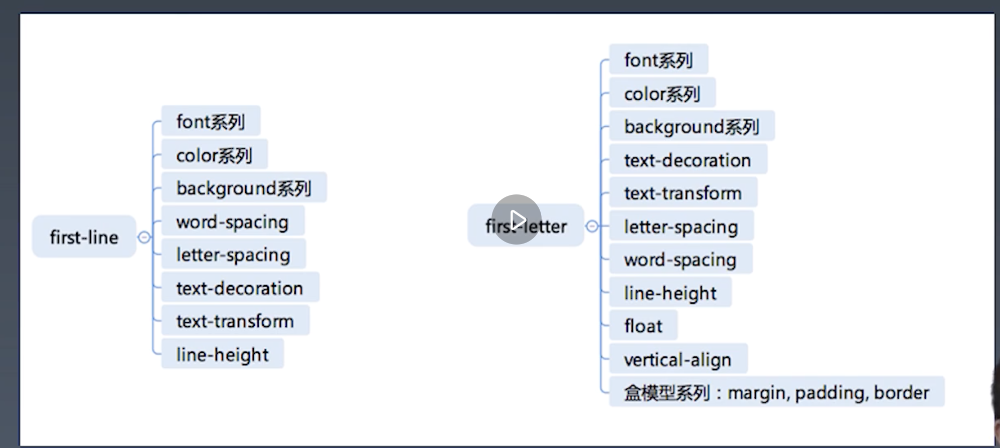

### 1. CSS总论 | CSS语法的研究
对于一门语言的研究， 应该从语法入手。对于css我们从css2.1入手, 然后基于2.1去找到css3新增的rule。
[css2.1](https://www.w3.org/TR/CSS21/grammar.html#q25.0)

[css-syntax-3](https://www.w3.org/TR/css-syntax-3)

总结： css总体结构
* @charset
    * @charset CSS @规则  指定样式表中使用的字符编码。它必须是样式表中的第一个元素，而前面不得有任何字符。因为它不是一个嵌套语句，所以不能在@规则条件组中使用。如果有多个 @charset @规则被声明，只有第一个会被使用，而且不能在HTML元素或HTML页面的字符集相关 style 元素内的样式属性内使用。

```css
    @charset "UTF-8";
    @charset "iso-8859-15";
```

* @import
* rules： 可以出现多个， 并且对顺序没有要求
    * @media
    * @page: 规定打印的样式， 对于要打印出来的页面做优化
        * @page 规则用于在打印文档时修改某些CSS属性。你不能用@page规则来修改所有的CSS属性，而是只能修改margin,orphans,widow 和 page breaks of the document。对其他属性的修改是无效的。
    * rule： 一般的css选择器 + 属性

### 2. CSS总论 | CSS @规则的研究
1. at-rules
    * @charset: [css-syntax-3](https://www.w3.org/TR/css-syntax-3/)
    * @import: [css-cacade-4](https://www.w3.org/TR/css-cascade-4/)
    * @media: [css-cacade-4](https://www.w3.org/TR/css3-conditional/)
    * @page: [css-cacade-4](https://www.w3.org/TR/css3-page-3/)
    * @counter-style: [css-cacade-4](https://www.w3.org/TR/css-counter-styles-3/)

    * @keyframes: [css-cacade-4](https://www.w3.org/TR/keyframes/)
    * @fontface: [css-cacade-4](https://www.w3.org/TR/css-fonts-3/)
    * @supports: [css-cacade-4](https://www.w3.org/TR/css3-conditional/)
    * @namespace: [css-cacade-4](https://www.w3.org/TR/css-namespaces-3/)

### 3. CSS总论 | CSS规则的结构
* css规则
    * 选择器
        * https://www.w3.org/TR/selectors-3/
        * https://www.w3.org/TR/selectors-4/
    * 声明
        * key
            * properties
            * variables: https://www.w3.org/TR/css-variables/
        * value
            * https://www.w3.org/TR/css-values-4

### 4. CSS总论 | 收集标准
爬虫收集w3c
* -> www.w3.org

### 6. CSS选择器 | 选择器语法

1. 简单选择器
    * *
    * div svg|a
        * svg|a 是指选择在svg中的a标签
    * .cls
    * #id
    * ```[attr=value]```
    * :hover
    * ::before

2. 简单选择器语法
    * 复合选择器
        * <简单选择器> <简单选择器> <简单选择器>
        * *或者id必须写在最前面
    * 复杂选择器
        * <复合选择器> \<sp\> <复合选择器>
        * <复合选择器> ">" <复合选择器>
        * <复合选择器> "~" <复合选择器>
        * <复合选择器> "+" <复合选择器>
        * <复合选择器> "||" <复合选择器>

### 7. CSS选择器 | 选择器的优先级

1. 简单选择器计数
    ```
        #id div.a#id {
            // [内联样式， id选择器， class选择器， 标签选择器] => [0, 2, 1, 1]
            所以优先级等于= 0 * N^3 + 2 * N^2 + 1 * N^1 + 1
            N = 1000000

            S = ?
        

        }
    ```

### 8. CSS选择器 | 伪类
1. 链接/行为: 最早的一批伪类是给超链接使用的
    * :any-link 匹配所有的超链接
    * :link 匹配还没有访问的超链接
    * :visited
    * :hover
    * :action
    * :focus
    * :target
2. 树伪类
    * :empty
    * :nth-child()// event/odd/4N + 1
    * :nth-last-child()
    * :first-child
    * :last-child
    * :only-child
3. 逻辑型伪类
    * :not
    * :where
    * :has

### 9. CSS选择器 | 伪元素
伪元素
* ::before
* ::after

* ::fist-line
* ::first-letter



思考题：为什么 first-letter 可以设置 float 之类的，而 first-line 不行呢？（提交至 GitHub）

winter老师在课程里说过， 对于first-line在不同的环境下表现不一致， 这就会导致， first-line控制的元素数量不一致. 对于排版能否达到预期比较难的控制。