### 1. CSS排版 | 盒
1. 盒
    * 标签/元素/盒
    ```
    HTML代码中可以书写开始__标签__，结束__标签__ ，和自封闭__标签__ 。

    一对起止__标签__ ，表示一个__元素__ 。

    DOM树中存储的是__元素__和其它类型的节点（Node）。

    CSS选择器选中的是__元素__ 。

    CSS选择器选中的_元素___ ，在排版时可能产生多个__盒__ 。

    排版和渲染的基本单位是_盒___ 。
    ```
    * 盒模型
        * box-sizing: 
            * border-box: width = content-width + border + padding;
            * content-box: width = content-width;

    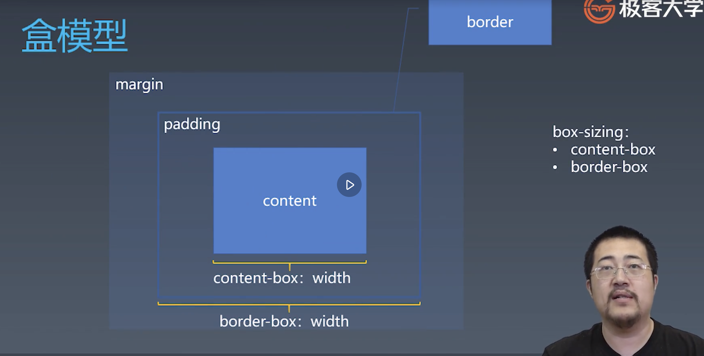

### 2. CSS排版 | 正常流
1. 当前存在的排版技术
    * normal document flow
        * 
        * 正常流排版
            * 收集盒进行（hang 一声）
            * 计算盒在行（hang 一声）中的排布
                * 正常排版基于基线 
                * 字形定义
                    * 本质上是码点
                * 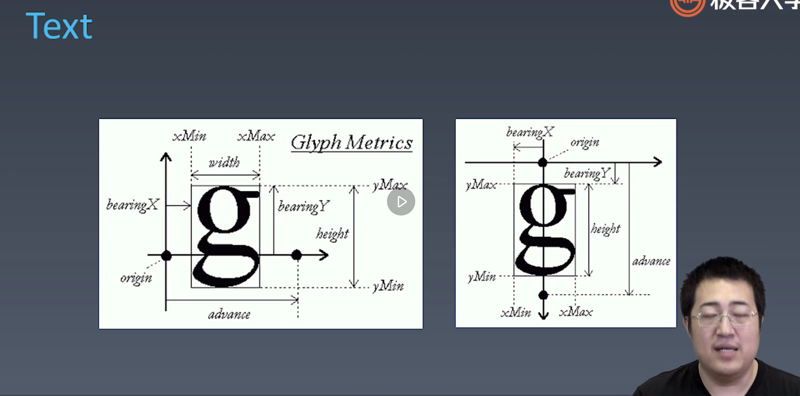
                * css行模型
                * 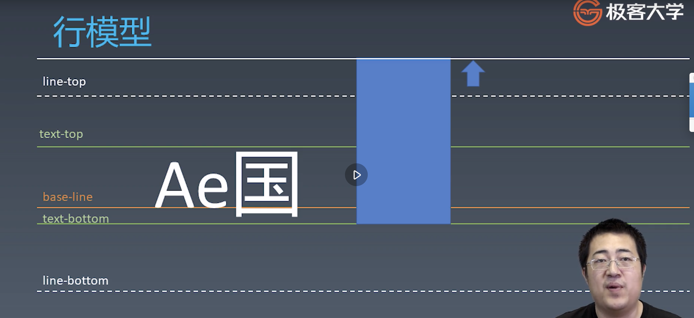
                * vertical-align: 高度撑开的方向， 需要重点去了解。
            * 计算行（hang 一声）的排布
        * 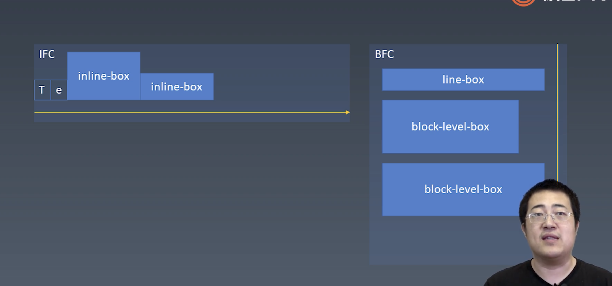
    * float
    * flex
    * grid
    * css houdini

### 4. CSS排版 | 正常流的块级排布
1. float 行为
    * 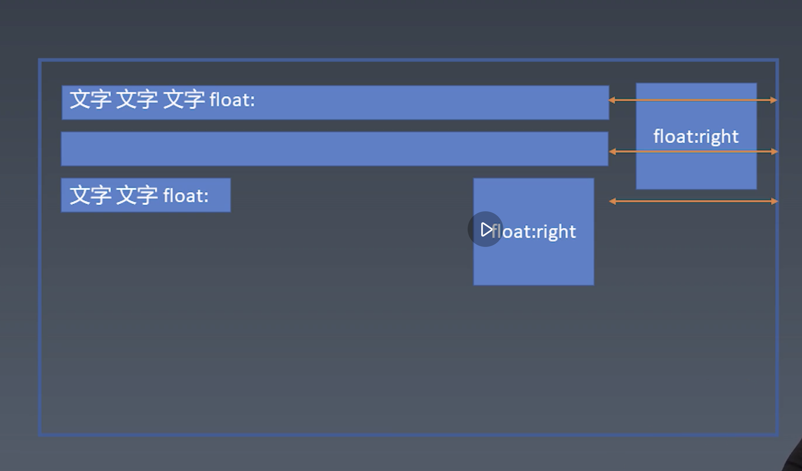
    * float可能会导致浏览器重排行为

2. margin collapse: 上下排布的盒模型， margin会出现折叠， 以最大的margin作为他们之间的高度
    * 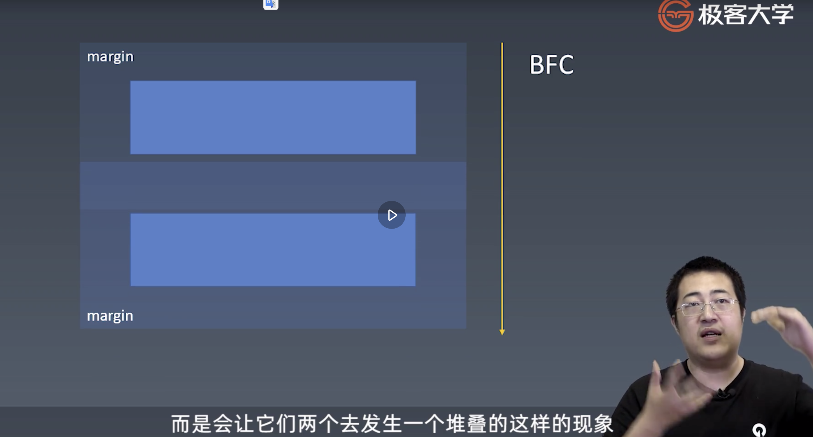

### 5. CSS排版 | BFC合并
1. block相关概念
    * 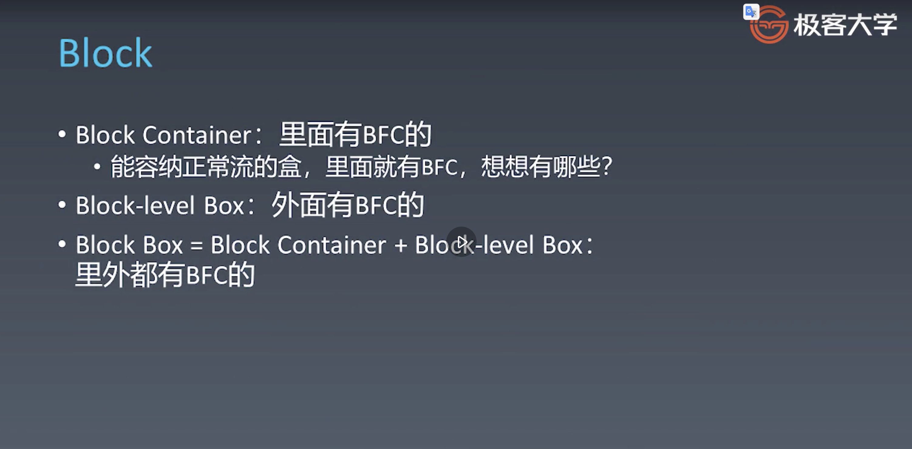
2. block container: 可以容纳内部不是特殊的display的元素.内部即为正常流.
    * 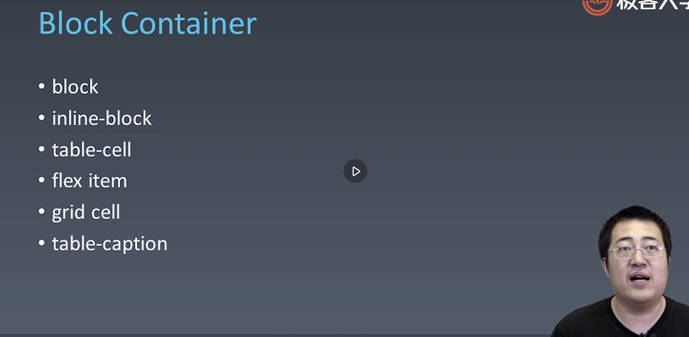
3. block level box
    * 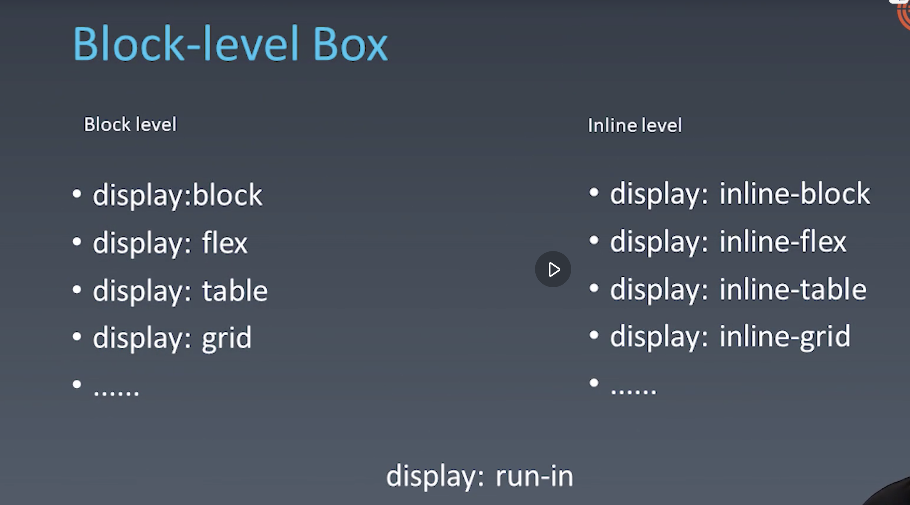
4. 设立BFC: 默认， 可以容纳正常流的盒， 都会创建BFC
    * 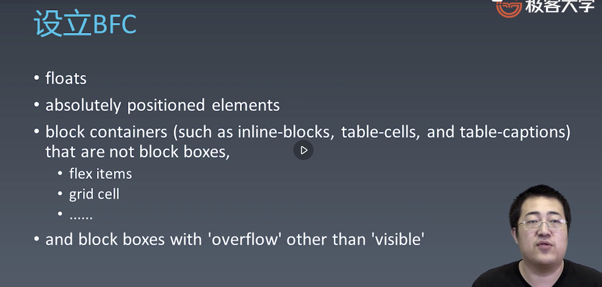
5. BFC合并
    * 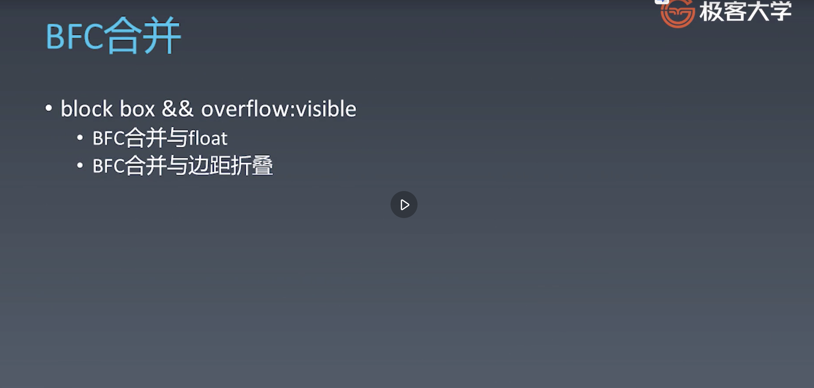
    * 边距折叠只会发生在同一个bfc中
    ```
    // 如果第二个div的overflow为visible, 那么其内部的元素会被第一个div的margin影响, 产生边距折叠
    // 如果第二个div的overflow为visible， 那么符合建立新bfc的要求， 此时第二个div会被当作一个单独的bfc元素对待。（不会出现边距折叠）
    <div style={{width: '100px', height: '100px', margin: '1rem'}}>1</div>
    <div style={{overflow: 'visible', margin: '2rem'}}>
    <!-- <div style={{overflow: 'hidden'}}> -->
    <div style={margin: '1rem'}></div>
    </div>
    ```
    * bfc造成float的合并:
    ```
    // 如果第二个div的overflow为visible, 那么其内部的元素会被第一个div的float影响， 环绕第一个div布局。
    // 如果第二个div的overflow为visible， 那么符合建立新bfc的要求， 此时第二个div会被当作一个单独的bfc元素对待。 与第一个div并排排列。（不会出现内部的元素环绕第一个div的情况）
    <div style={{float: 'right', width: '100px', height: '100px'}}>1</div>
    <div style={{overflow: 'visible'}}>
    <!-- <div style={{overflow: 'hidden'}}> -->
    something.
    something.
    something.
    something.
    something.
    something.
    something.
    something.
    something.
    something.
    something.
    something.
    something.
    something.
    something.
    something.
    </div>
    ```

### 6. CSS排版 | Flex排版
1. Flex 排版
    * 收集盒进入行
        * 根据主轴尺寸， 把元素分入行
        * 如若设置了no-wrap, 则强行分配进第一行
    * 计算盒在主轴方向的排布
        * 找出所有flex元素
        * 把主轴方向剩余尺寸按比例分给这些元素
        * 如若剩余空间为负数， 所有的flex元素为0， 等比压缩这些元素
    * 计算盒在交叉方向的排布 
        * 根据每一行最大的元素尺寸计算行高
        * 根据行高flex-align和item-align， 确定元素具体位置

### 7. CSS动画与绘制 | 动画
1. Animation
    * @keyframes定义 / 使用
    ```css
    @keyframes mkf {
        from {background: red;}
        to {background: blue;}
    }

    div {
        animation: mkf 5s infinite;
    }
    ```
    * API解读
        * animation-name
        * animation-duration
        * animation-timing-function
        * animation-delay
        * animation-iteration-count: 播放次数
        * animation-direction: 播放方向
2. Transition
    * 使用
        * transition-property: 变换的属性
        * transition-duration: 变换的时长
        * transition-timing-function: 变换曲线函数
        * transition-delay: 延迟
    * timing-function
        * cubic-bezier.com


### 8. CSS动画与绘制 | 颜色
分类
* cmyk
* rgb
* hsl
* hsv


### 9. CSS动画与绘制 | 绘制
1. 绘制
    * 几何图形
        * border
        * box-shadow
        * border-radius
    * 文字
        * font
        * text-decoration
    * 位图
        * background-image
2. 应用技巧
    * data url + svg
