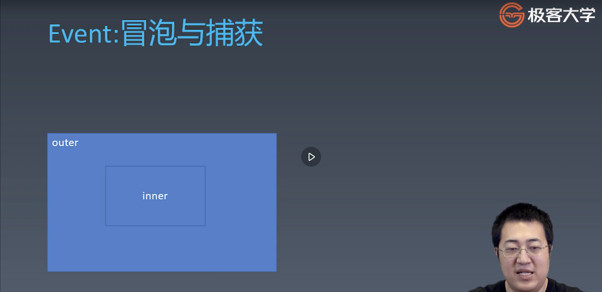
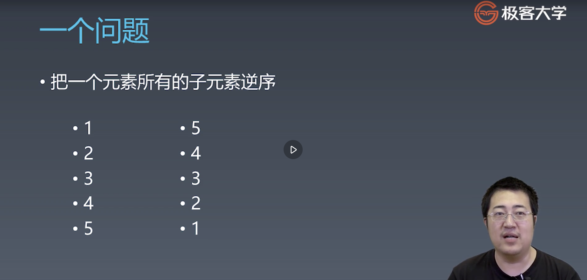

### 1. 重学HTML | HTML的定义：XML与SGML
1. DTD与xml namespace
    * http://www.w3.org/TR/xhtml1/DTD/xhtml1-scrict.dtd
    * http://www.w3.org/1999/xhtml
2. 需要掌握的转义字符

### 2. 重学HTML | HTML标签语义
1. aside 承载非主体页面信息
2. main 承载页面主体
3. nav 导航类目
4. strong/em
    * strong 表明内容强调
    * em 表明语气强调
5. pre 预设内容


### 3. 重学HTML | HTML语法
1. 合法元素
    * Element:  
    ```
    <tagName>...<tagName>
    ```
    * Text: text
    * Comment: 
    ```
    <!-- comment -->
    ```
    * DocumentType: 
    ```
    <!Doctype html>
    ```
    * ProcessingInstruction: 
    ```
    <?a1?>
    ```
    * CDATA: 文本语法的另一种表达， 在里边不需要考虑转义字符
    ```
    <![CDATA[]]>
    ```
2. 字符引用语法
    * &#161；
    * &amp；
    * &lt；
    * &quot；

### 4. 浏览器API | DOM API
1. Node
    * Element
        * HTMLElement
            * HTMLAnchorElement
            * HTMLAppleElement
            * HTMLAreaElement
            * HTMLAudioElement
            * HTMLBaseElement
            * HTMLBodyElement
            * ...
        * SVGElement
            * SVGElement
            * SVGAltGlyphElement
            * ...
    * Document
    * CharacterData
        * Text
	        * CDATASection
        * Comment
        * ProcessingInstruction
    * DocumentFragment
    * DocumentType

2. 导航类操作: element的导航会忽略文本节点, 而node的导航不会忽略文本啊， 空白符等节点
    * parentNode
	    * parentElement
    * childNodes
	    * children
    * firstChild
	    * firstElementChild
    * lastChild
	    * lastElementChild
    * nextSibling
	    * nextElementSibling
    * previousSibling
	    * previousElementSibling

3. 修改操作
    * appendChild
    * insertBefore
    * removeChild
    * replaceChild

4. 高级操作
    * compareDocument Position： 用于比较两个节点中关系的函数
    * contains: 检查一个节点是否包含另一个节点的函数
    * isEqualNode: 检查两个节点是否完全相同
    * isSameNode: 检查两个节点是否是同一个节点， 实际在js中可以使用“===”
    * cloneNode: 复制一个节点，如果传入参数true, 则会连同子元素一起拷贝


### 5. 浏览器API | 事件API
1. addEventListener api 解析
    * type
    * listener
    * option
        * true / false
        * passive / once / capture / 
            * capture : 控制冒泡模式 还是 捕获模式
            * once : 表示这个事件不是只响应一次
            * passive : 表示这个事件是否是一个不会产生副作用的事件（例如： onScroll这类高频次的事件我们传入passive参数往往可以达到提升性能的作用）

2. capture: 默认行为就是冒泡
    * 捕获：先触发父元素的事件， 然后逐级往下传递事件
    * 冒泡：默认行为， 先触发触发行为的元素， 然后逐级向上传递



### 6. 浏览器API | Range API
首先来看一道面试题：

* 题目存在几个考点：
    1. 首先要理解， dom节点，取出的collection是live collection. 会跟着你的操作变化而变化。
    2. 子元素进行insert的时候 ，不需要先remove在insert.
    3. 使用range API 进行高效操作

* 什么是range api? 在html文档流中， 有起始点和终止点的一个连续的范围.
    * 创建range
        * var range = new Range();
        * range.setStart(element, 9);
        * range.setEnd(element, 4);
        * var range = document.getSelection().getRangeAt(0);
    * API
        * range.setStartBefore
        * range.setEndBefore
        * range.setStartAfter
        * range.setEndAfter
        * range.selectNode
        * range.selectNodeContent
    * range 操作
        * var fragment = range.extractContents(); // 从dom树取出range内的所有节点
        * range.insertNode(document.createTextNode('aaa'));// 在range中执行insert操作
        ```html
        <div id="a">123<span style="background-color: pink;">456789</span>012345</div>
        <script>
        let range = new Range();
        let aDom = document.getElementById('a');
        range.setStart(a.childNodes[0], 3);
        range.setEnd(a.childNodes[2], 3);

        // 移除范围内节点 aoe伤害， 还可以移除半个标签， 移除之后会自动用一个空的对应标签补全
        // range.extractContents();

        </script>
        ```


```html
<div id="a">
    <span>1</span>
    <p>2</p>
    <a>3</a>
    <div>4</div>
</div>
<script>
let element = document.getElementById('a');

// normal version
function reverseChildren(element) {
    // 拿到复制后的数组dom, 此时已经跟原来的element node隔离， 不会出现同步改动的情况
    let children = Array.prototype.slice.call(element.childNodes);

    // 从dom树中移除节点， 但是其实不必要， 同时可以通过element.innerHTML = '' 来清空节点
    for (let child of children) {
        element.removeChild(child);
    }

    // 反转元有的dom节点数组
    children.reverse();

    // 把反转后的dom数组插入父节点
    for(let child of children) {
        element.appendChild(child);
    }


}

// 利用dom节点特性： 节点的删除不会影响前一个元素
function reverseChildren1() {
    var l = element.childNodes.length;
    while(l-- > 0) {
        element.appendChild(element.childNodes[l]);
    }
}

// 利用range API 完成
function reverseChildren2() {
    let range = new Range();
    range.selectNodeContents();

    let fragment = range.extractContents();
    var l  = fragment.childNodes.length;
    while(l-- > 0) {
        fragment.appendChild(fragment, fragment.childNodes[l]);
    }
    element.appendChild(fragment);
}


</script>


```

### 7. 浏览器API | CSSOM
1. document.styleSheets
    * document.stylesheets
    * 案例
    ```HTML
    <style>
    a {
        color: red;
    }
    </style>

    <link rel="stylesheet" title="x" href="data:text/css,p%7Bcolor:blue%7D" />
    <a>world</a>
    <script>
    console.log(document.styleSheets);


    </script>
    ```
2. styleSheets - Rules
    * document.styleSheets[0].cssRules
    * document.styleSheets[0].insertRule("p {color:pink;}", 0)
    * document.styleSheets[0].removeRule(0)

3. rule: 其实是跟css语法一一对应
    * CSSStyleRule
    * CSSCharsetRule
    * CSSImportRule
    * CSSMediaRule
    * CSSFontFaceRule
    * CSSPageRule
    * CSSNamespaceRule
    * CSSKeyframesRule
    * CSSKeyframeRule
    * CSSSupportsRule
    * ...

4. cssStyleRule
    * selectorText String
    * style K-V结构

5. getComputedStyle
    * window.getComputedStyle(elt, pseudoElt);
    * elt 想要的元素
    * pseudoElt 可选参数， 伪元素


### 8. 浏览器API | CSSOM View
1. window view api
    * window.innerHeight/window.innerWidth： 可视区域
    * window.outerWidth/window.outerHeight: 包含工具栏等， 整个浏览器尺寸
    * window.devicePixelRatio： 物理设备像素
    * window.screen
        * window.screen.width: 实际屏幕宽/高
        * window.screen.height
        * window.screen.availWidth： 可以使用的宽和高（例如安卓机器中， 底部非实体按钮算在实际高度中，但并不属于可用高度）
        * window.screen.availHeight

2. window api
    * window.open("url", "target", "window style")
    * moveTo(x, y)
    * moveBy(x, y)
    * resizeTo(x, y)
    * resizeBy(x, y)

3. window scroll api
    * element node
        * scrollTo
        * scrollLeft
        * scrollWidth
        * scrollHeight
        * scroll(x, y)
        * scrollBy(x, y)
        * scrollIntoView()
    * window
        * window.scrollX
        * window.scrollY
        * window.scroll(x, y)
        * window.scrollBy(x, y)

4. layout
    * getClientRects() // 获取所有包裹在内部的盒模型
    * getBoundingClientRect() // 获取当前盒模型


### 9. 浏览器API | 其它API
1. 我们浏览器的api来源， 也就是谁敲定这些api: 标准化组织·
    * khronos
        * webGL
    * ECMA
        * ECMAScript
    * WHATWG
        *  HTML
    * W3C
        * webaudio
        * CG/WG

