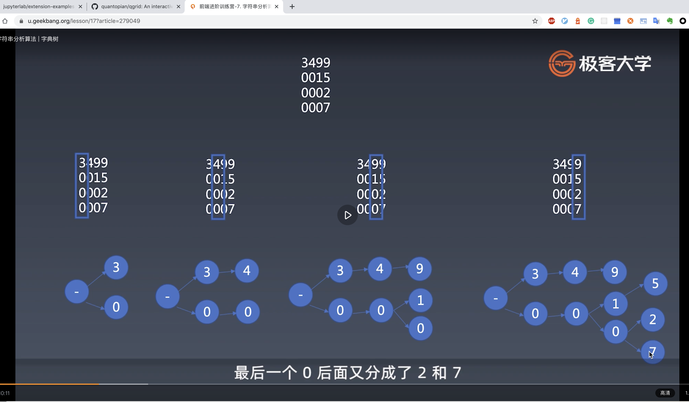

### 1. 使用LL算法构建AST | 四则运算
1. 四则运算 - 词法定义
    * TokenNumber
        * 1, 2, 3, 4, 5, 6, 7, 8, 9, 0 任意组合
    * Operator: + - * / 之一
    * Whitespace: 
    ```
    <SP>
    ```
    * LineTerminator:
    ```
    <LF>
    <CR>
    ```
2. 四则运算 - 语法定义
```
// EOF: End of file
<Expression>::=<AdditiveExpression><EOF>

<AdditiveExpression>::=<MultiplicativeExpression>
    |<AdditiveExpression><+><MultiplicativeExpress>
    |<AdditiveExpression><-><MultiplicativeExpress>

<MultiplicativeExpression>::=<Number>
    |<MultiplicativeExpression><*><Number>
    |<MultiplicativeExpression></><Number>
```

3. LL 语法分析
```
<AdditiveExpression>::=<MultiplicativeExpression>
    |<AdditiveExpression><+><MultiplicativeExpress>
    |<AdditiveExpression><-><MultiplicativeExpress>

// 对当前产生式进行展开
<AdditiveExpression>::=<Number>
    |<MultiplicativeExpress><+><Number>
    |<MultiplicativeExpress></><Number>
    |<AdditiveExpression><+><MultiplicativeExpress>
    |<AdditiveExpression><-><MultiplicativeExpress>

```

4. 实现LL语法分析

### 2. 字符串分析算法
* 字典树
    * 大量高重复字符串的存储与分析
* KMP
    * 在长字符串里找模式
* 正则
    * 字符串通用模式匹配
* 状态机
    * 通用字符串分析
* LL LR
    * 字符串多层级结构分析

### 3. 字典树
字典树， 基于现有字符组进行一个树形存储。 特点是基于每个位置的字符作为树的层级。


### 4. KMP
KMP是一种模式匹配算法： 查一个字符串里面有没有另一字符串。有一个原串和一个待查的串。 复杂度是m + n;

如果我们使用暴力破解，那么算法时间复杂度为 m * n. 

KMP解决了重复计算的问题。优化了模式串中重复子串的问题。例如模式串为： abababc


来看个栗子：
1. pattern: abcdabce
2. source: abcdabcdabcex

### 5. Wildcard
思路大概是， 通过star切分子串， 然后在每个子串里使用正则去匹配对应子串。
```
wildcard: ab*c?d*abd*a?d
    * 只有*： ab*cd*abc*a?d
    * 只有？： c?d, a?d
```