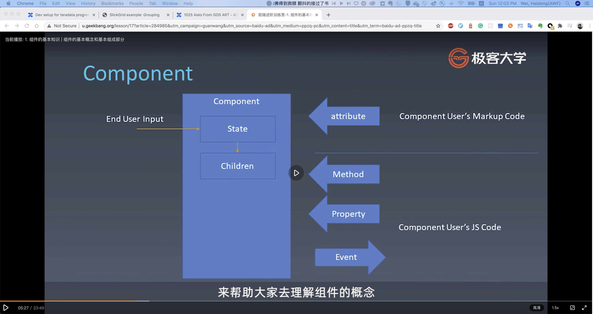
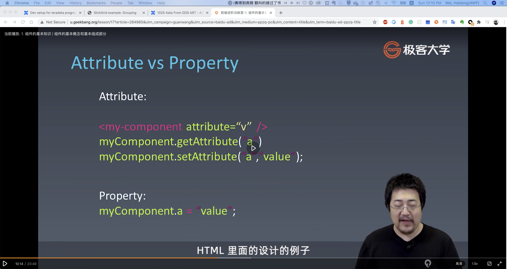
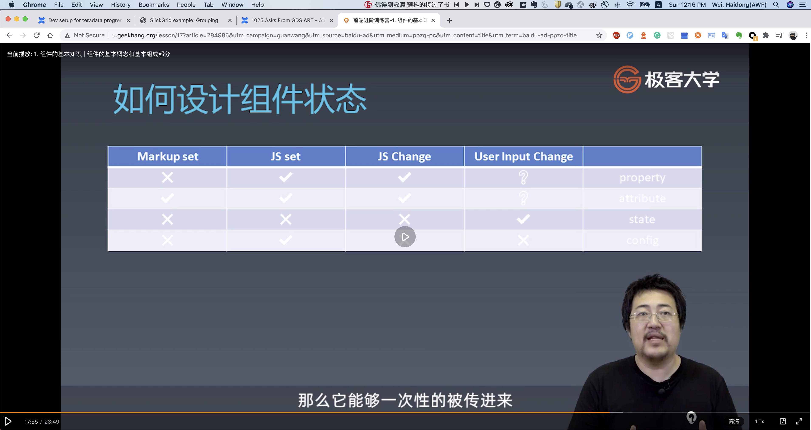
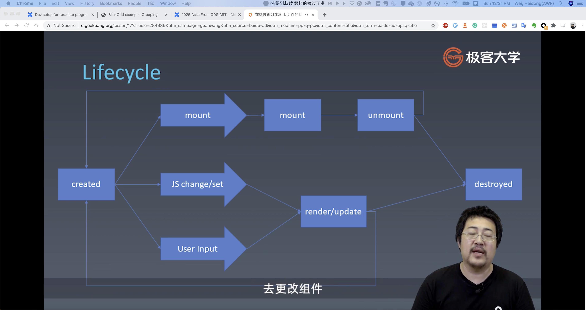
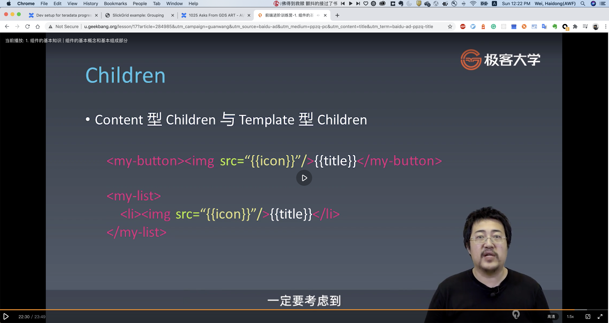

### 1. 组件的基本知识 | 组件的基本概念和基本组成部分
* 对象与组件
    * 对象
        * Properties
        * Methods
        * Inherit
    * 组件
        * Properties
        * Methods
        * Inherit
        * Attribute
        * Config & State
        * Event
        * Lifecycle
        * Children
* 组件属性关系图
    * 

* Attribute vs Property
    * Attribute: 强调描述关系
    * Property: 强调从属关系
    * HTML中的attribute描述的是该组件本身存在的特性。 而在我们js编程中的property则是描述， 该对象下a的值是什么（从属）
    * 

* Component State
    * ;
    * property: 不可通过markup 设置， 可以在组件初始化用js设置， 可以通过js去改变， 组件使用者是否可以改变取决于设计者的思路
    * attribute: 只可以通过markup设置
    * state: 不提供修改state的方法， 仅根据用户的改变而同步组件内部的state
    * config: 应该只在组件初始化的时候可以配置， 不可更改， 一般留给全局

* Lifecycle
    * 一定存在的两个生命周期
        * created/destroyed
    * ;

* children
    * content型
    * template型
    * ;

### 2. 组件的基本知识 | 为组件添加JSX语法

